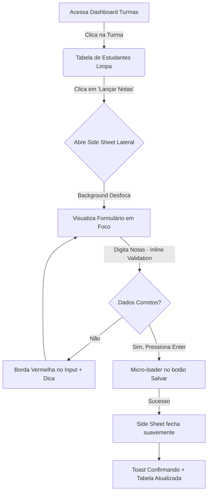
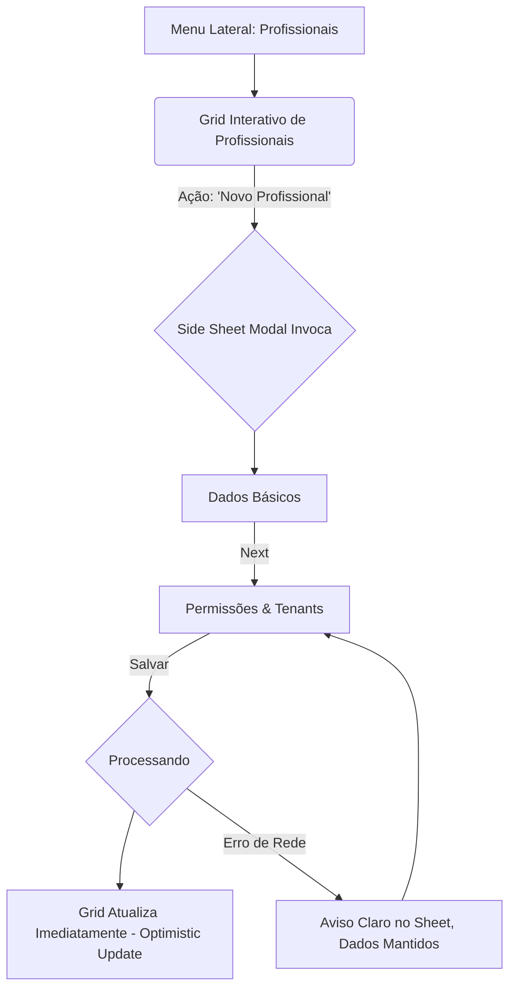

# UX Design Specification plataforma

**Author:** Fernando
**Date:** 2026-02-28

---

## Executive Summary

### Project Vision

Realizar uma repaginada (redesign) no front-end da plataforma atual, adotando uma linguagem visual e padrões de interação modernos e limpos, fortemente inspirados no **shadcn/ui**. O objetivo é modernizar a interface, melhorar a usabilidade e a acessibilidade construtiva, mantendo no entanto a paleta de cores original para preservar a identidade visual da marca.

### Target Users

Usuários da plataforma educacional/institucional (Gestores, Coordenadores, Professores e Estudantes), que necessitam de fluxos de trabalho claros, visualização de dados limpa (tabelas, formulários, dashboards) e uma transição suave para o novo modelo visual sem uma curva de aprendizado frustrante.

### Key Design Challenges

- **Consistência Visual:** Adaptar os conceitos do shadcn/ui (historicamente feitos para React/Tailwind) para a nossa stack atual no front-end (Angular/SCSS), garantindo que os componentes e formulários Mat-Material se comportem de forma consistente com este estilo minimalista.
- **Harmonização de Cores:** Aplicar a paleta de cores existente da plataforma dentro da estrutura minimalista e de contraste exigida pelo estilo "shadcn".
- **Refatoração Responsiva:** Garantir que grandes tabelas de dados e modais de formulário complexos funcionem impecavelmente em dispositivos móveis e desktops.

### Design Opportunities

- **Micro-interações Modernas:** Utilizar feedbacks de hover, estados de *focus* e de carregamento mais polidos (skeletons e layouts clean).
- **Acessibilidade Melhorada:** Aproveitar a repaginada para elevar o padrão de contraste e navegação.
- **Dark Mode Elevado:** O estilo shadcn tem excelente suporte a variáveis baseadas em CSS (HSL) o que facilita a implementação de um "dark mode" elegante, mantendo as diretrizes de cores do projeto.

## Core User Experience

### Defining Experience

A experiência principal será focada em **eficiência sem atritos**, inspirada na filosofia do shadcn. Isso significa reduzir ao máximo o ruído visual: a interface deve sair do caminho para que o conteúdo (como aulas, notas, listas de estudantes) seja sempre o protagonista. A navegação será fluida, rápida e baseada em hierarquias claras criadas através do refinado uso de tipografia, espaçamento consistente e cores.

### Platform Strategy

O sistema rodará no ambiente Web (navegadores desktop e mobile) utilizando a infraestrutura atual em Angular e SCSS. A estratégia é refatorar os componentes existentes do Angular Material ou criar nossos próprios componentes baseados no "estilo shadcn", prezando pela total responsividade, independentemente se o usuário estiver em um celular consultando notas ou num monitor largo administrando profissionais.

### Effortless Interactions

- **Preenchimento de Formulários:** Formulários complexos que ganham "fôlego" adotando espaçamentos claros e dicas contextuais (tooltips, validações inline minimalistas), reduzindo o estresse cognitivo do preenchimento.
- **Navegação de Dados:** Tabelas densas se tornam limpas e escaneáveis. Interações simples (como ordenar, filtrar ou criar novos itens via modais) devem abrir rapidamente e responder imediatamente sem interrupções perceptíveis.
- **Acessibilidade Embutida:** Ações através do teclado (tabbing natural, escapes para fechar modais) e compatibilidade perfeita para leitores de tela devem ser requisitos fundamentais e interações sem esforço para quem necessita.

### Critical Success Moments

- O primeiro momento em que um professor abre uma tela complexa de lançamento de notas ou presenças e, pela primeira vez, consegue visualizar as informações de forma limpa, clara e não-esmagadora.
- Quando um gestor acessa relatórios rápidos do dashboard sem sentir peso ou atraso no rendering no desktop e entende a informação através do design clean dos cards.
- Transições imersivas em que a mudança entre "Dark Mode" e "Light Mode" ressoa organicamente com o comportamento noturno/diurno do usuário.

### Experience Principles

- **O Conteúdo Acima da Borda:** Reduzir decorações gráficas desnecessárias; a informação é a interface.
- **Consistência Sem Surpresas:** Padrões estritos de comportamento em todos os modais e botões. Um tipo de botão se comporta da mesma forma, em qualquer ponto.
- **Micro-interações Funcionais:** Animações que apenas servem para dar clareza posicional ou feedback direto aos cliques. 
- **Beleza Útil:** A interface deve parecer extremamente polida e premium, o que incita confiança através da sensação de estabilidade visual.

## Desired Emotional Response

### Primary Emotional Goals

- **Calma e Clareza:** O usuário não deve se sentir esmagado pela quantidade de informações. Tabelas de notas e cadastros longos devem ser processados visualmente sem causar fadiga.
- **Confiança Institucional:** A interface (usando tipografia limpa e contrastes precisos inspirados no shadcn) deve transparecer que o sistema é sólido, seguro e de alto nível.
- **Empoderamento:** Sem se perder em menus confusos, o usuário (seja gestor ou professor) deve sentir que domina a ferramenta, completando suas tarefas rapidamente.

### Emotional Journey Mapping

- **Ao fazer o Login / Acessar pela 1ª vez:** Sensação de "respiro". O ambiente é limpo, familiar, mas visivelmente mais moderno e acolhedor.
- **Durante uma tarefa complexa (ex: Matrículas/Notas):** Foco puro. A interface "some" e apenas os dados relevantes ganham destaque, transformando tensão em eficiência.
- **Após concluir uma tarefa:** Satisfação originada por micro-interações de sucesso pontuais (um toast sutil, um checkmark animado, sem estardalhaço).
- **Ao encontrar um erro:** Segurança. O erro não deve parecer crítico ou "quebrado". Tooltips e borders em vermelho leve mostrarão exatamente como corrigir, reduzindo a frustração.

### Micro-Emotions

- **Confiança (vs. Incerteza):** Botões com estados de desabilitado/carregando (`spinners` elegantes) demonstram exatamente o que o sistema está fazendo.
- **Alívio (vs. Carga Cognitiva):** Encontrar a informação certa no dashboard de forma instantânea através de uma tipografia bem hierarquizada.

### Design Implications

- Se queremos **Confiança**, as bordas (borders), radius (arredondamento) e sombras (shadows) precisam ser matematicamente consistentes em todo lugar, sem componentes desalinhados.
- Se queremos **Calma**, utilizaremos *whitespace* (espaços em branco) de forma generosa e intencional. Menos linhas separadoras duras e mais separações por sutis contrastes de fundo ou espaço.
- Para manter a **Identidade**, nossa paleta de cores original será encaixada no sistema de tokens do shadcn (background, foreground, muted, accent, primary), garantindo a acessibilidade.

### Emotional Design Principles

- **O Silêncio Visual:** Se algo não interage ou não informa um dado essencial, remova ou torne-o `muted`.
- **Acessibilidade é Conforto:** O contraste perfeito não é apenas uma regra, é o que evita dor de cabeça no fim do dia para o gestor.
- **Feedback Elegante:** Informar sem interromper.

## UX Pattern Analysis & Inspiration

### Inspiring Products Analysis

A principal fonte de inspiração será o ecossistema do **shadcn/ui** (e os produtos criados com ele, como Vercel e Stripe). 
*   **O que ele resolve:** Ele remove a sensação de "site em template genérico". Ele trata os componentes não como pacotes imutáveis, mas como fragmentos de código de alta qualidade, garantindo total flexibilidade.
*   **Estética:** Faz uso extensivo de HSL para cor, contrastes fortes de preto/branco, contornos sutis (1px solid borders de baixo contraste), tipografia Inter (ou fontes modernas sans-serif análogas) rigorosamente escaleada.

### Transferable UX Patterns

Olhando para essa inspiração, aplicaremos nativamente no nosso ambiente Angular os seguintes padrões de interação:

*   **Padrões Visuais (O Estilo Shadcn):** 
    *   Bordas sutis em *Cards* com padding generoso e sombras (box-shadow) quase imperceptíveis, mas difusas.
    *   Textos secundários usando uma cor "Muted" (geralmente uma variação do cinza escuro/claro baseada no *foreground*).
    *   Cores "Primary" (que manteremos da paleta atual do projeto) aplicadas de forma enxuta para indicar interatividade e botões principais.
    *   Variáveis CSS para *radiuses* (ex: `--radius: 0.5rem;`) permitindo consistência de arredondamento nos botões, modais e inputs ao longo do sistema.

*   **Padrões de Interação:**
    *   **Dropdowns & Menus:** Limpos, abertos com uma pequena animação de *fade/scale*, com indicações claras de foco nos itens.
    *   **Inputs:** Remover sublinhados nativos do Material Design antigo e usar contornos plenos (*outline*) nos inputs, com anéis de foco coloridos na cor "Ring".
    *   **Sheet/Modals:** Menus laterais (*Sheets*) em vez de criar páginas completas para cadastros não-essenciais.

### Anti-Patterns to Avoid

*   **"O Efeito Árvore de Natal":** Uso excessivo de muitas cores diferentes para os componentes ao mesmo tempo. Tudo o que não for ação principal deve ser monocromático / muted.
*   **Shadows Pesadas:** Sombras antigas de estilo neumorfismo ou "Material 1 e 2".
*   **Forms Compactos Demais:** Remover os "espaçoscofóbicos". Componentes apertados dificultam acessos *touch*.

### Design Inspiration Strategy

**What to Adopt:**
*   A nomenclatura de tokens do shadcn (background, foreground, card, popover, primary, secondary, muted, accent, destructive, border, input, ring).
*   A tipografia sóbria e alinhamentos milimétricos.

**What to Adapt:**
*   Como nosso projeto é Angular, ao invés de usar Tailwind, construiremos um sistema forte e limpo no SCSS Global que replique exatamente os visuais desses tokens, mantendo a interoperabilidade com o Material Angular subjacente.

**What to Avoid:**
*   Interfaces animativas exageradas.
*   Conflito com as cores atuais da plataforma.

## Design System Foundation

### 1.1 Design System Choice

**Abordagem Recomendada: Sistema Tematizável Híbrido (Angular Material "Desmaterializado" + CSS Variables globais estilo ShadCN)**

Em vez de adotar um framework totalmente novo (ou migrar para React/Tailwind), manteremos o motor funcional do projeto (Angular e Angular Material em que ele se apoia), mas sobreporemos uma camada global e densa de variáveis CSS estritas que replicam os tokens do shadcn.

### Rationale for Selection

- **Velocidade de Refatoração:** Ao manter o Angular Material por baixo dos panos para componentes complexos (tabelas, selects nativos, datepickers), economizamos meses de reescrita funcional.
- **Precisão Visual (Uniqueness):** O Angular Material *parece* com o Google. Usaremos tokens CSS e diretivas para alterar bordas, sombras e cores globalmente para que ele deixe de parecer o Material e passe a assumir a estética premium/minimalista do ShadCN.
- **Manutenibilidade a Longo Prazo:** Não ficaremos reféns de bibliotecas instáveis mantidas por terceiros no ecossistema Angular; teremos o controle de classes utilitárias e variáveis para estilizarmos sob demanda.

### Implementation Approach

1. **Camada de Variáveis Base:** Criar um arquivo `theme.scss` global que espelhe a arquitetura de tokens HSL do shadcn. Ex: `--background`, `--foreground`, `--primary`, `--muted`, `--border`.
2. **Overrides Globais:** Criar um mixin/arquivo de override para o Angular Material (ex: `mat-form-field`, `mat-button`) que remova os estilos pesados do Material V1/V2 (backgrounds preenchidos nos inputs, underlines, ripples pesados) e injete os tokens do shadcn.
3. **Componentes "From Scratch":** Componentes mais simples, como `Cards`, `Badges` (Chips) e Modais podem ser re-estilizados usando puro CSS/SCSS através de componentes "dumb" (burros) no Angular.

### Customization Strategy

Nós garantiremos que a paleta de cores original da plataforma não se perca. Construiremos scripts em SCSS para gerar as variações HSL (Hue, Saturation, Lightness) com base nas hex colors primárias da plataforma, injetando-as nas variáveis de `--primary` e `--ring`. 
O "Dark Mode" poderá ser adotado naturalmente invertendo os tokens `--background` e `--foreground` e alterando a *Lightness* do HSL sem precisarmos refazer o CSS dos componentes.

## 2. Core User Experience

### 2.1 Defining Experience

A experiência central (o momento "Aha!" do redesign) será a **"Interação Silenciosa" com grids de dados e formulários**. Quando um professor precisa lançar a nota de 40 estudantes ou um gestor cadastra uma nova filial, ele não verá um labirinto de inputs espalhados. O usuário passará por tabelas escaneáveis que respondem a cliques sem salto de página e formulários desenhados em modais laterais (Sheets) de carregamento assíncrono.
Se nós acertarmos essa interação (Dados densos -> Tratamento limpo e rápido), todo o resto da plataforma será naturalmente intuitivo.

### 2.2 User Mental Model

**Hoje:** O modelo mental atual (fortemente influenciado pelo Angular Material v1/v2 tradicional) diz que "ações demoram a carregar" e "processos complexos exigem que eu saia da tela atual".
**Como mudaremos isso:** Vamos alinhar ao modelo mental ensinado pelos aplicativos web modernos (como Notion, Vercel ou Stripe). O usuário espera que ações como "Editar" ou "Adicionar" abram painéis flutuantes rápidos (Dialogs/Sheets) preservando o contexto (a tabela atrás) visível, sem perdê-lo de vista.

### 2.3 Success Criteria

- **Zero Page Jumps:** Uma tarefa de gestão completa (como cadastrar um profissional e assigná-lo a um tenant) deve acontecer confortavelmente dentro da tela atual.
- **Micro-validações:** O usuário jamais deve clicar em "Salvar" para só então descobrir, via um erro gigante vermelho, que faltou algo. Inputs com o estilo shadcn oferecerão validação no nível do campo (*Inline Validation*).
- **Consistência de Saída:** O ESC no teclado sempre fecha um modal. O "Enter" sempre submete quando apropriado. A previsibilidade deve beirar os 100%.

### 2.4 Novel UX Patterns

**O que estamos inovando na nossa arquitetura:**
Aplicaremos extensivamente o padrão de **Sheet (Menu Lateral Modal)** do shadcn. Muitas vezes, um Dialog (modal clássico centrado) esmaga o conteúdo em telas pequenas ou não tem respiro para formulários grandes. Ao adotar o Side Sheet para ações complexas (Editar Aluno, Gerenciar Notas), aproveitamos a altura inteira da tela, garantindo que longos scrolls de formulário ocorram sem atrapalhar e, no mobile, esse Sheet desliza do fundo para cima naturalmente.

### 2.5 Experience Mechanics

**O Fluxo Mestre (Exemplo com Tabelas):**
1. **Initiation:** Botões de ação principais (`mat-stroked-button` customizados ou botões primary sutis) localizados invariavelmente no canto superior direito do Grid/Tabela.
2. **Interaction:** Clicar num destes itens invoca instantaneamente um Sheet lateral acompanhado de um leve *backdrop blur*. Se os dados do usuário estiverem sendo buscados via backend, aparecerão "Skeletons" (barras de progresso que imitam o layout) em vez de uma tela vazia piscando.
3. **Feedback:** Campos errados mostram uma sutil borda de ring error (`--destructive`). O botão de salvar terá um loader microscópico integrado durante requisições. Sucesso desencadeará um *Toast* não-intrusivo no canto inferior direito que se apaga sozinho.
4. **Completion:** O Sheet se recolhe suavemente. Caso fosse a criação de um item, o grid atrás exibirá instantaneamente a nova adição injetada no topo via otimização no state do Angular.

## 3. Visual Design Foundation

### 3.1 Color System

**Estratégia:** Adotar a paleta de cores original da marca (Hex/RGB), porém convertendo-a para os *Design Tokens* baseados em HSL (Hue, Saturation, Lightness) requeridos pelo padrão shadcn.

- **Background & Foreground:** Branco puro (`hsl(0, 0%, 100%)`) para background em *Light Mode* e texto em cinza quase preto (`hsl(222.2, 84%, 4.9%)`) para nitidez máxima. 
- **Brand Colors (Primary):** A cor principal atual da plataforma atuará como `--primary`, e criaremos subtons automaticamente (via modificação de Lightness em SCSS) para estados de `--primary-foreground` (texto sobre botões) dependendo do nível de contraste requerido (WCAG).
- **Muted & Accents:** Tons cruciais para a estética limpa. Usaremos neutros acinzentados (com levíssima saturação da cor da marca) para marcações de fundo de tabelas, contornos (borders) e textos secundários.
- **Feedback Cores (Semantic):** Vermelho (Destructive), Amarelo (Warning) e Verde (Success) padronizados e suavemente desaturados.

### 3.2 Typography System

**Estratégia:** Moderna, altamente legível e feita para UIs densas em dados. 

- **Primary Font:** **Inter** (ou *Geist* / *Roboto*, garantindo que seja um *sans-serif* limpo). Essa fonte foi projetada para interfaces e numerais em tabelas parecem cristalinos.
- **Hierarquia Estrita:** Escala linear clássica. `H1` (2.25rem), `H2` (1.5rem), `Body` (1rem, ou 16px para não haver resize automático em formulários web no iOS).
- **Table Density:** Linhas de tabelas utilizarão tamanhos sutilmente menores (0.875rem - 14px) para condensar dados verticais confortavelmente.

### 3.3 Spacing & Layout Foundation

**Estratégia:** O espaçamento é a espinha dorsal de um design tipo shadcn.

- **Base Unit:** Escala de 4px (`0.25rem`). Isso garante matematicamente que todos os componentes (margens, paddings, ícones) se alinhem perfeitamente num grid lógico (4, 8, 12, 16, 24, 32px...).
- **Border Radiuses:** Padronização absoluta. Usaremos `--radius: 0.5rem` (8px base) para *Cards* e *Modais*, e `0.375rem` (6px) para Botões e Inputs, trazendo aquele toque "Apple/Vercel" premium. Muito arredondamento parece infantil, cantos retos demais parecem legados.

### 3.4 Accessibility Considerations

- Todo contraste primário contra o fundo precisará passar na taxa 4.5:1 exigida pelas regras AAA. O modelo HSL de cores facilita consertar constrastes dinamicamente.
- Formulários herdarão states corretos no CSS (como `:focus-visible`) substituindo o horrível anel azul padrão do Chrome por anéis de fóco cinza ou da cor primária, idênticos em todos os browsers.

## 4. Design Direction Decision

### 4.1 Design Directions Explored

Exploramos conceptualmente como a estética **shadcn** (minimalista, monocromática com pontos de destaque, e rica em micro-interações) pode se fundir com os componentes densos do nosso cenário educacional. Discutimos abordagens como:
1. **Material Design Puro (Status Quo):** Descartado por ser familiar, mas não transparecer a modernidade exigida.
2. **Reescrita Total em Tailwind:** Descartado pelo altíssimo esforço de reescrever formulários e tabelas complexas do Angular Material.
3. **Híbrido Tematizado (Angular Material base + Vercel/Shadcn Aesthetic):** Escolhido. Combina velocidade de implementação com o visual premium desejado.

### 4.2 Chosen Direction

Foi selecionada a direção de **"Densidade Limpa" (Clean Density)**. 
Esta direção assume que o usuário lida com muita informação (notas, alunos, frequências) e foca em reduzir o "peso" da interface:

- **Layout Geral:** Um layout de aplicação estruturado. Uma `sidebar` de navegação lateral fixa, estreita (ou recolhível), com um cabeçalho (topbar) muito limpo contendo apenas `Breadcrumbs` (caminho atual) e ações globais de usuário.
- **Áreas de Conteúdo (Grids):** Utilizam fundos brancos puros. Tabelas não têm linhas verticais, apenas separadores horizontais muito sutis (`--border`). Cabeçalhos de tabela adotam fonte `Muted` e em letras minúsculas (`lowercase` ou texto comum) em oposição ao caixa-alta pesado do Material padrão.
- **Painéis e Formulários:** Substituição drástica de `Dialogs` (modais centrais) pesados por `Side Sheets` (Modais que deslizam a partir do canto direito da tela). Quando os recursos da tela precisarem mudar contextualmente, o background recebe um desfoque suave (`backdrop-blur`).

### 4.3 Design Rationale

As razões para esta escolha baseiam-se nos nossos **Objetivos Emocionais (Calma e Empoderamento)**. 
Professores e Coordenadores vivem com pressa. Formulários densos em páginas cheias causam exaustão. Os `Side Sheets` permitem que o usuário consulte a tabela principal (ao fundo) enquanto edita a nota de um aluno. Tabelas sem bordas pesadas e botões sem fundo (ou text/outline) reduzem o cansaço ocular após horas de uso, enquanto as cores da marca (Primary) chamam a atenção incisivamente APENAS para o botão "Salvar" ou "Aprovar".

### 4.4 Implementation Approach

A execução prática será conduzida com cirurgia técnica:
1. **Reset do Angular Material (Typography e Densidade):** Substituiremos globalmente a fonte Roboto pela **Inter**. Aplicaremos `density: -2` ou `-3` em alguns componentes Material para nivelar seus tamanhos à percepção mais compacta/limpa do web moderno.
2. **Tokens Customizados no SCSS:** Criaremos as classes de utilitários cruciais para espaçamento e cor (HSL) que replicam as lógicas de utilitários.
3. **Componentização de Layout:** Criaremos um componente de `Layout` mestre para envolver a Sidebar + Topbar + Content, garantindo que as transições de rota fiquem estritamente na área de Content sem piscar a tela inteira.

## 5. User Journey Flows

### 5.1 Lançamento Rápido de Notas (Professor)

Esta jornada foca no momento de maior carga cognitiva do professor. Diferente do passado onde ele navegava por várias telas, agora ele fará tudo sem perder o contexto da turma.

**Mecânica da Jornada:** O professor nunca sai da página da turma. O formulário vem até ele, valida erros imediatamente (sem esperar o save) e o devolve exatamente onde estava após o sucesso.

### 5.2 Gestão de Profissionais (Gestor)

O Gestor precisa cadastrar rapidamente e assignar permissões.

**Mecânica da Jornada:** Dividimos o cadastro longo em "Steps" lógicos dentro do próprio modal. Se a internet falhar após ele preencher 20 campos, o Side Sheet rebola o erro mas **não** fecha nem perde os dados preenchidos.

### 5.3 Journey Patterns

Padrões cruzados identificados para padronizarmos em toda a plataforma:
- **Context Preservation:** Navegação profunda acontece na horizontal (Menu -> Area -> Tabela -> Side Sheet) em vez de empilhar telas substituindo a página inteira.
- **Escape Hatch:** Qualquer Side Sheet ou Dropdown sempre pode ser fechado instantaneamente apertando `ESC` no teclado, como o usuário espera em uma aplicação desktop.
- **Inline Correction:** Os erros são reportados no momento em que o campo perde o foco (`onBlur`), não apenas no clique do botão "Salvar".

### 5.4 Flow Optimization Principles

- **Minimize Page Reloads:** Utilizar as capacidades de roteamento do Angular para trocar views de forma instantânea.
- **Skeleton over Spinners:** Substituir o spinner circular genérico ou telas brancas piscando por componentes "Skeleton" (o contorno cinza do layout carregando), diminuindo a percepção de demora no backend.
- **Optimistic UI:** Onde for seguro, quando o usuário adidionar ou deletar um item, o grid web deve refletir a mudança instantaneamente na tela enquanto a requisição viaja até a API em background, mascarando a latência da rede.

## 6. Component Strategy

### 6.1 Design System Components (Angular Material Base)

Para manter a estabilidade e aproveitar o trabalho pesado já feito pelas diretivas estruturais do Angular, **manteremos o núcleo dos seguintes componentes do Material (via importação `@angular/material`)**, mas injetaremos fortemente a estilização global via CSS (overrides) para assumirem o aspecto "shadcn":

*   `MatTable`: Extremamente robusto para uso nativo. Os overrides removerão sombras, borders excessivas e mudarão o header box.
*   `MatFormField` / `MatInput` / `MatSelect`: Essenciais pela acessibilidade e controle de formulários que já temos. O layout será alterado para `appearance="outline"`, com `border-radius` reduzido e cores suaves inspiradas nos tokens HSL; anéis de focus-visible também serão aplicados globalmente.
*   `MatDatePicker`: Continuará a base nativa, porém padronizado com os botões arredondados e cores do novo tema HSL.
*   `MatSnackBar`: Servirá como o motor nativo para nossos Toasts minimalistas (cantos inferiores).

### 6.2 Custom Components (The "shadcn" Replications)

O Material Design tem lacunas ou componentes pesados demais para certas interações desta diretriz "Densidade Limpa". Construiremos as seguintes "cascas" ou componentes em Angular:

**1. Modal Side Sheet (`AppSideSheet`)**
- **Purpose:** O coração das novas jornadas. Exibe formulários de criação/edição sem sair da tabela.
- **Usage:** Invocado à direita da tela, pegando a altura máxima.
- **Anatomy:** Header (Title + ESC trigger), Scrollable Content Area, Sticky Footer (Ações).
- **Background:** Precisa incorporar o `backdrop-blur` sobre as tabelas existentes.

**2. Skeleton Loader (`AppSkeleton`)**
- **Purpose:** Preencher dados que estão sendo carregados via API sem reflow visual brusco ou spinners brutos.
- **Anatomy:** Div simples em formato de barra/círculo cinza claro (`bg-muted`) rodando com uma animação sutil de *pulse*.
- **Variants:** Block (para cards falsos), Text Line (para headers falsos), Circle (para avatares).

**3. Badge / Status Label (`AppBadge`)**
- **Purpose:** Mostrar "Ativo", "Inativo", ou status de aprovação em listagens. Os chips do Material são muito robustos e espaçados. Criaremos badges puros (HTML + CSS).
- **Variants:** Primary, Secondary (muted colors), Outline, Destructive (vermelho).

### 6.3 Component Implementation Strategy

Nossa estratégia será de **Refatoração Seletiva e Progressiva**.

1. **Camada Fundamental:** O arquivo `styles.scss` (global) receberá todo o framework HSL. Todo e qualquer `MatButton` por exemplo, mudará instantaneamente de cara em toda a plataforma quando ativarmos esse novo styles;
2. **Camada Específica:** Onde o CSS puro não resolve (ex: Side Sheets versus dialogs normais), criaremos componentes específicos baseados em Angular purista.
3. As classes utilitárias seguirão nomes amigáveis baseados no Tailwind, ex: `text-muted-foreground`, facilitando que desenvolvedores acostumados com Vercel ou React entendam rapidamente nossa estrutura na hora de construir.

### 6.4 Implementation Roadmap

Priorizando o MVP desta interface minimalista para o ecossistema educacional:

**Phase 1 - The Core Foundation (Semana 1):**
- Instalação dos CSS Tokens base (Colors, Spacing, Typography).
- Overrides globais dos Inputs (`mat-form-field`, botões, modais clássicos) e Tabelas;

**Phase 2 - The Core Interactions:**
- Criação e integração do Componente Customizado `AppSideSheet`.
- Migração dos formulários de Gestão (Criação de Professor, Turma) dos Modais atuais para os Side Sheets.

**Phase 3 - The Polish:**
- Criação dos `AppSkeleton` e substituição dos spinners de carregamento brutos de telas.
- Finalização de Tipografia em relatórios profundos.

## 7. UX Consistency Patterns

### 7.1 Button Hierarchy

Não podemos ter uma "Árvore de Natal" de botões coloridos em uma única tela.
- **Primary:** (`mat-flat-button` + var cor brand). Usado apenas uma vez por contexto (ex: Botão "Salvar" no Side Sheet, ou "Novo Cadastro" no topo do Grid).
- **Secondary / Default:** (`mat-stroked-button` / Outline). Para ações recorrentes como "Editar", "Exportar", "Filtrar". O contorno fornece presença sem peso visual.
- **Ghost / Muted:** (`mat-button` sem fundo). Usado dentro de linhas de tabelas para ações rápidas, e para o botão de "Cancelar" em modais.
- **Destructive:** Vermelho saturado (`#ef4444`). Usado APENAS em exclusões ou remoções de acesso. Devem sempre vir acompanhados de confirmação.

### 7.2 Feedback Patterns

Nosso princípio emocional é "Calma". Feedbacks não devem causar ansiedade.
- **Success:** Notificação Toast (`Snackbar`) não-obstrutiva no canto inferior direito, que some automaticamente. Sem modais parando a tela obrigando clique no "Ok".
- **Error (Formulário):** Borda vermelha (*Ring Destructive*) nos inputs específicos que falharam, seguidos do texto de erro logo abaixo em fonte tamanho "small" e cor "Muted Destructive".
- **Error (Rede/Sistema):** Toast informativo ("Não foi possível conectar, tentando novamente...") ou, em caso de erro massivo, um alert inline (`AppBadge` Destructive) dentro do contexto do erro, sem estourar o layout inteiro.
- **Loading:** Para dados estruturados (tabelas e listas), usar skeleton loaders `AppSkeleton`. Para ações de botões pequenos (Salvar/Excluir), usar um micro-spinner dentro do próprio botão ocultando o texto, travando o formulário temporariamente.

### 7.3 Form Patterns

Formulários representam 80% do trabalho dos usuários (Gestores e Professores).
- **Placement:** Formulários com mais de 3 campos habitam **Side Sheets**, nunca Dialogs centrais ou expansões de tabelas.
- **Asteriscos:** Campos obrigatórios são sempre identificados. Se houver muitos opcionais, a indicação "(Opcional)" dentro do placeholder é preferível.
- **Inline Validation:** Validar on `blur` (ao sair do campo) para campos complexos (ex: CPF validado via API), mas garantir que mensagens de erro não fiquem piscando enquanto o usuário digita.

### 7.4 Navigation Patterns

- **Sidebar (Menu Principal):** Posição à esquerda, com possibilidade de recolhimento ("Collapsed") mantendo apenas ícones para maximizar área útil em desktop. Item ativo no menu sempre recebe um background sutil "Accent" e bordado leve lateral.
- **Breadcrumbs:** Sempre presentes na Topbar, indicando localização exata (ex: Cursos > Eng. Elétrica > Turma A).
- **Escape Hatch:** As áreas de "Content" devem permitir clique fora (Backdrop Click) ou a tecla `ESC` no teclado para o fechamento seguro (Side Sheets, Dropdowns).

### 7.5 Empty States

- Nunca mostrar uma "Página em Branco" ou uma Grid sem dados. 
- Quando um professor não tem alunos lançados, usar um bloco central (Empty State) contendo um Ícone Muted, Texto explicativo claro e um Botão de Ação Primary (ex: "Adicionar Primeiro Estudante").

## 8. Responsive Design & Accessibility

### 8.1 Responsive Strategy

A aplicação segue uma abordagem "Desktop-First" para as ferramentas de gestão profunda profunda, mas "Mobile-Optimized" para visualização e apontamentos do professor.

- **Desktop (Gestores / Operação Pesada):** Maximiza o uso de Side Sheets expansivos (até 50% da largura da tela) e Grids completos.
- **Tablet (Professores / Coordenação em campo):** Elementos de interação por touch aumentados. Sidebar de navegação recolhida por padrão. As tabelas começam a ocultar colunas secundárias para não exigir scroll horizontal constante.
- **Mobile (Consultas rápidas):** As Side Sheets virtuais se transformam em `Bottom Sheets` (deslizando de baixo para cima) ocupando 95% da tela. As tabelas densas, caso não caibam, viram um "Stack" de Cards contendo as informações chave de cada item listado.

### 8.2 Breakpoint Strategy

Utilizando a fundação de breakpoints em comum acordo com frameworks como Tailwind/Shadcn, implementados no nosso SCSS:

- `sm`: **640px** (Celulares Geração Atual) - Ponto de virada para converter Table rows em Cards e Side Sheets em Bottom Sheets.
- `md`: **768px** (Tablets Portrait) - Sidebar colapsa.
- `lg`: **1024px** (Laptops / Tablets Landscape) - Área de conteúdo livre.
- `xl`: **1280px+** (Desktops) - Permite o uso do Side Sheet sem sobrepor a tabela principal 100%.

### 8.3 Accessibility Strategy

Nosso objetivo é aderência estrita à **WCAG 2.1 Level AA**, disfarçada dentro da estética minimalista. O design shadcn é nativamente focado nisto.

- **Constraste Dinâmico:** As cores HSL no `theme.scss` garantem matematicamente contraste 4.5:1. O `--muted-foreground` não pode ser muito claro sobre o `--background`.
- **Focus Management:** Não dependeremos de `outline: none;` irresponsável. O `mat-form-field` re-estilizado mostrará um "Ring" em `--ring` color (geralmente cinza leve ou cor primária com opacidade) de espessura 2px em volta do input sempre que focado via teclado (`:focus-visible`).
- **Target Sizes (Touch):** Qualquer elemento clicável (botões em tabelas, ícones de filtro) deve possuir um padding invisível para garantir a área de toque recomendada pela Apple/Google de 44x44px em telas `< lg`.
- **Screen Readers:** Manutenção dos atributos `aria-label` e `aria-describedby` nativos do Angular Material. 

### 8.4 Testing Strategy

- **Automated A11y:** Durante o CI/CD ou uso local do Storybook/Angular CLI, rodar testes (axe-core ou lighthouse) para alertar sobre queda de contraste ou falta de labels caso novos componentes customizados sejam introduzidos.
- **Manual Keyboard Check:** Nenhuma feature pode ser lançada sem o QA/Dev conseguir operá-la usando apenas a tecla `TAB`, `Space` e `Enter`.
- **Responsive Simulators:** Testar todas as Views de Listagem no Chrome DevTools com os presets "Moto G4" e "iPad Pro" validadas.

### 8.5 Implementation Guidelines

- **Desenvolvedores:** "Nunca force tamanhos fixos de `height` em divs que contêm texto". Use `min-height` se necessário.
- **Media Queries:** Não use pixels mágicos no meio do código (ex: `@media (max-width: 934px)`). Sempre use as funções e mixins SCSS criados em `media.scss` usando as variáveis da *Breakpoint Strategy*.
- **Flex/Grid:** Toda refatoração deve abandonar floats ou posicionamento absoluto em busca de `display: flex` com `gap` usando os tokens de espaçamento do sistema.
